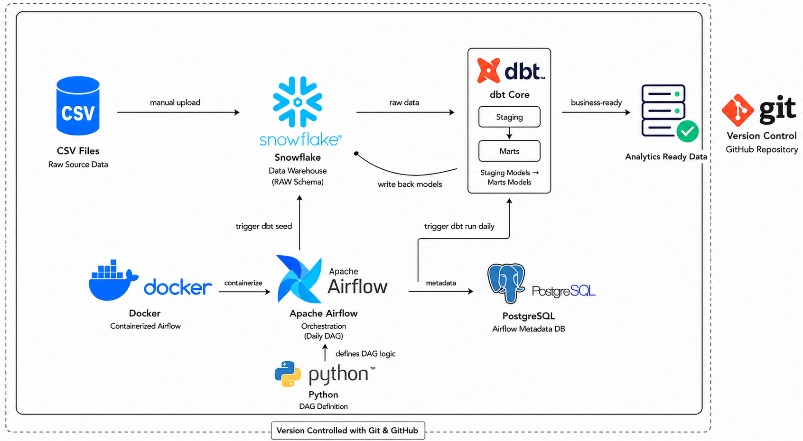

# 🛒 E-Commerce Pipeline with dbt, Snowflake & Airflow


---

## 📌 Overview

A **production-ready, end-to-end data engineering pipeline** that covers the full lifecycle of data — from raw ingestion to clean, analytics-ready models — built on industry-standard modern data stack tools.

The pipeline ingests raw e-commerce data (customers, orders, products), transforms it through well-structured dbt layers, and orchestrates the entire workflow with Apache Airflow on a daily schedule.

---

## 🏗️ Architecture



---

## 🛠️ Tech Stack

| Tool | Purpose | Version |
|------|---------|---------|
| 🔴 **dbt Core** | Data transformation & modeling | Latest |
| ❄️ **Snowflake** | Cloud data warehouse | - |
| 🌬️ **Apache Airflow** | Workflow orchestration | Latest |
| 🐍 **Python** | Scripting & automation | 3.8+ |
| 🐙 **Git** | Version control | - |

---

## 📂 Project Structure

```
snowflake_dbt_project/
│
├── 📁 models/                  # dbt transformation models
│   ├── 📁 staging/             # Layer 1: Clean & standardize raw data
│   ├── 📁 marts/               # Layer 2: Business-ready aggregations
│   └── 📁 example/             # dbt example models
│
├── 📁 data files/              # Raw source data (CSV)
│   ├── 📄 customers.csv
│   ├── 📄 orders.csv
│   ├── 📄 order_items.csv
│   └── 📄 products.csv
│
├── 📁 seeds/                   # dbt seed configurations
├── 📁 macros/                  # Reusable dbt macros
├── 📁 analyses/                # Ad-hoc analysis queries
├── 📁 snapshots/               # dbt snapshots (SCD Type 2)
├── 📁 tests/                   # Data quality tests
│   └── 📄 snowflake_test.yml   # Snowflake data quality test configs
├── 📁 logs/                    # Airflow & dbt logs
├── 📁 target/                  # dbt compiled artifacts (gitignored)
│
├── 📄 dbt_core_dag.py          # Airflow DAG — daily pipeline orchestration
├── 📄 dbt_project.yml          # dbt project configuration
├── 📄 .gitignore               # Git ignore rules
└── 📄 README.md                # Project documentation
```

---

## 📊 Data Model

The pipeline processes **e-commerce data** across 4 core entities:

```
customers ──┐
            ├──► orders ──► order_items ◄── products
            │
            └──► [mart_customer_orders]
```

| Table | Description |
|-------|-------------|
| `customers` | Customer master data |
| `orders` | Order header records |
| `order_items` | Line-level order details |
| `products` | Product catalog |

---

## ⚙️ Setup & Installation

### 1️⃣ Clone the Repository

```bash
git clone https://github.com/mmagdyy1/dbt_snowflake_project.git
cd dbt_snowflake_project
```

### 2️⃣ Create a Virtual Environment

```bash
python -m venv venv

# Windows
venv\Scripts\activate

# Mac/Linux
source venv/bin/activate
```

### 3️⃣ Install Dependencies

```bash
pip install dbt-snowflake
pip install apache-airflow
```

### 4️⃣ Configure Snowflake Connection

Create your `profiles.yml` (⚠️ never commit this file):

```yaml
dbt_snowflake_project:
  target: dev
  outputs:
    dev:
      type: snowflake
      account: <your_account>
      user: <your_user>
      password: <your_password>
      role: <your_role>
      database: <your_database>
      warehouse: <your_warehouse>
      schema: <your_schema>
      threads: 4
```

### 5️⃣ Run dbt

```bash
# Load seed data
dbt seed

# Run all models
dbt run

# Test data quality
dbt test

# Generate documentation
dbt docs generate
dbt docs serve
```

---

## 🌬️ Airflow Orchestration

The pipeline is orchestrated via **`dbt_core_dag.py`** — an Airflow DAG that runs on a **daily schedule** and automates:

- ✅ Loading seed data into Snowflake
- ✅ Running dbt staging models
- ✅ Running dbt marts models
- ✅ Executing data quality tests

---

## 🧪 Data Quality Tests

dbt tests are configured to ensure:

- 🔑 **Uniqueness** – Primary keys are unique
- 🚫 **Not Null** – Critical fields are never null
- 🔗 **Referential Integrity** – Foreign keys are valid
- 📋 **Accepted Values** – Categorical fields contain valid values

---

## 👤 Author

**Mohamed Magdy**
[](https://github.com/mmagdyy1)

---

## 📄 License

This project is open source and available under the [MIT License](LICENSE).
